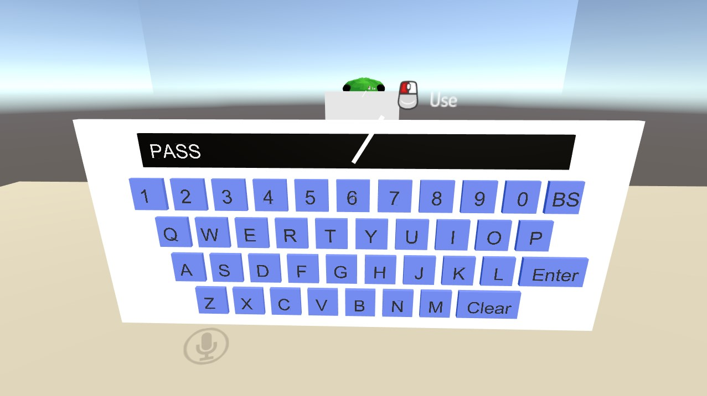
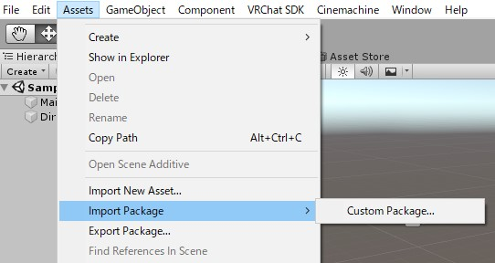
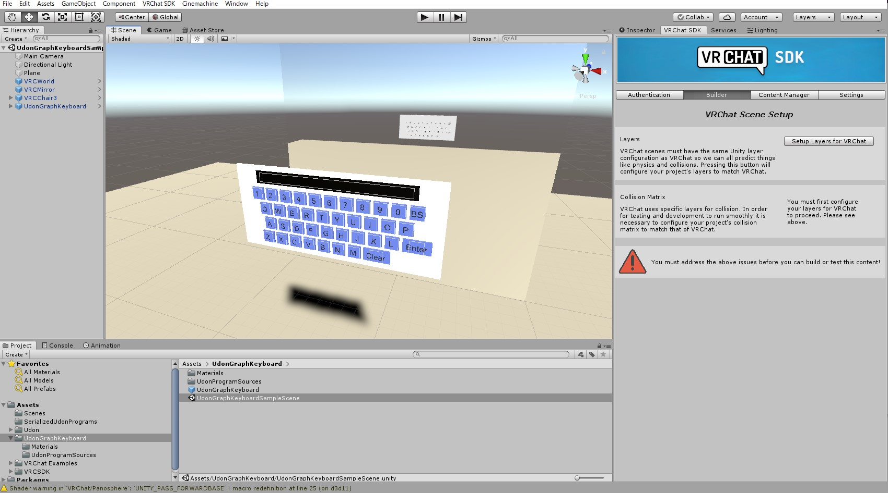
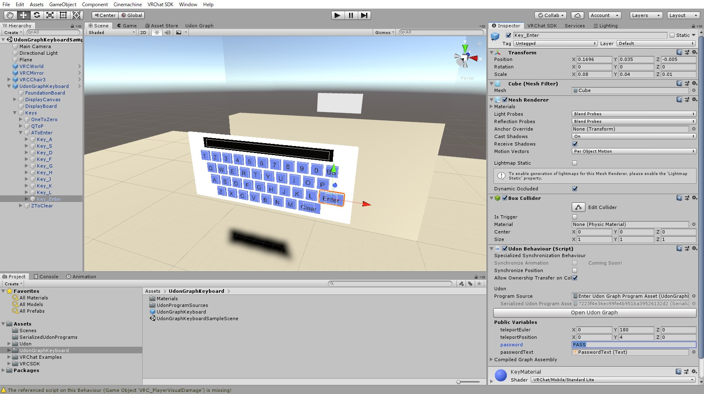
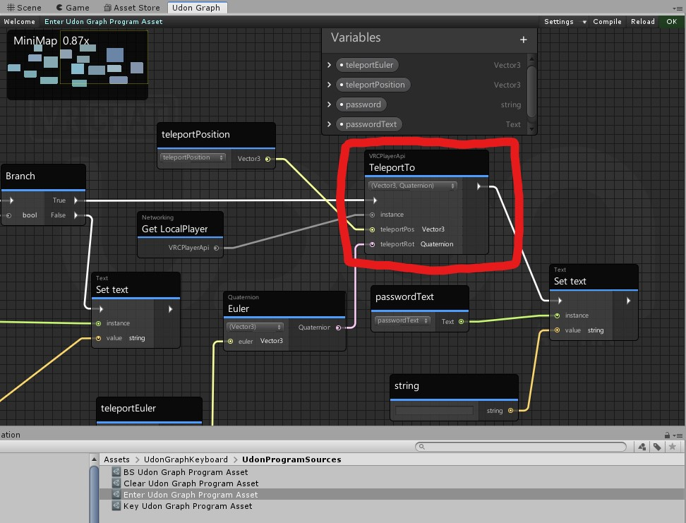

# UdonGraphKeyboard
Udon Sharp を使わない。VRChat Udon のみで動作する、 PC と Oculus Quest に両対応のパスワード入力用キーボードです。以下の図のようにキーボードにて 0~9A-Z までの文字を入力できる他、バックスペースキー(BS)、クリアーキー(Clear)、動作を規定するEnterキーが実装されています。また入力キーは上部のディスプレイに表示されます。

# インストール方法と使い方
VRChat SDK3 の Worlds (`VRCSDK3-WORLD-2020.11.16.12.43_Public.unitypackage`等) を comstom package としてインストールした Unity(指定されたcurrent versionのもの) にて、このリポジトリ内にある `UdonGraphKeyboard-202011221241.unitypackage` を comstom package としてインポートすることで利用できます。使う場合にはUdonGraphKeyboardフォルダ内にあるPrefabとなっている `UdonGraphKeyboard.prefab` を利用ください。

実際の動作は、`UdonGraphKeyboardSampleScene` をサンプルシーンとして用意してあるためそれを利用してください。インポート後、LayersのSetupとColision MatrixのSetupをすることで使えるようになります。

デフォルトではパスワードは `PASS` で、パスワードが一致してEnterキーを押すと4m上空に真後ろを向いてテレポートするように設定されています。動作を変えたい際には、`Key_enter` オブジェクトの変数を変更することで、パスワードとテレポート位置を変更することが可能です。

また `Enter Udon Graph Program Asset` の Udon Graphを編集して対応することでテレポート以外の動作をさせることも可能です。

# Oculus Questワールドのビルド方法
File > Build Settings... > Android > Switch Platform を行った後、 VRChat SDK の Control Panel より Build & Publish for Android してください。

# 動作確認済みVRChat SDKバージョン

- VRCSDK3-WORLD-2020.11.16.12.43_Public.unitypackage
- VRCSDK3-WORLD-2020.10.28.15.57_Public.unitypackage

# LICENSE
MIT License

